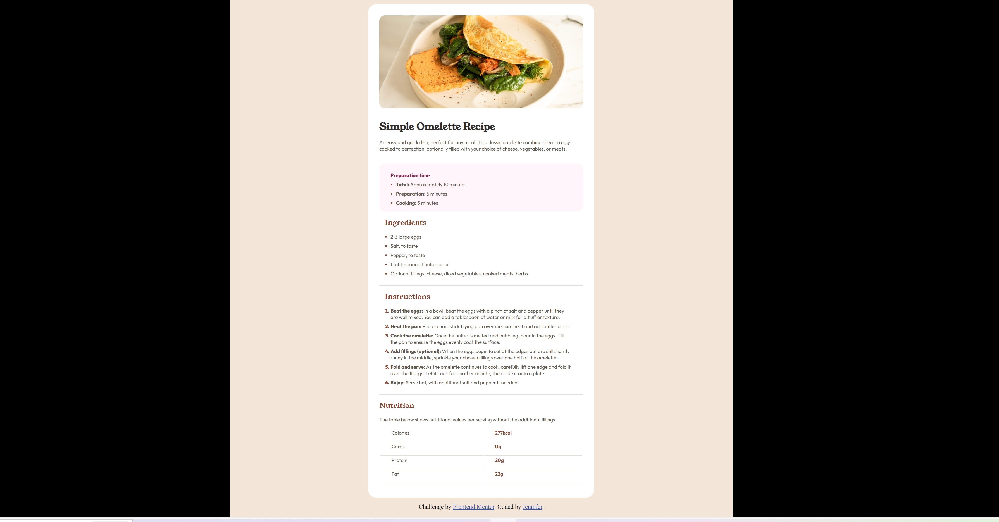

# Frontend Mentor - Recipe page solution

This is a solution to the [Recipe page challenge on Frontend Mentor](https://www.frontendmentor.io/challenges/recipe-page-KiTsR8QQKm). Frontend Mentor challenges help you improve your coding skills by building realistic projects. 

## Table of contents

- [Overview](#overview)
  - [The challenge](#the-challenge)
  - [Screenshot](#screenshot)
  - [Links](#links)
- [My process](#my-process)
  - [Built with](#built-with)
  - [What I learned](#what-i-learned)
  - [Continued development](#continued-development)
  - [Useful resources](#useful-resources)
- [Author](#author)
- [Acknowledgments](#acknowledgments)

## Overview
This challenge was to create a recipe card that is responsive and featured ordered and unordered lists and a table. It required both HTML and CSS skills.

### Screenshot

### Links

- Solution URL: [https://github.com/jvondungen/Recipe-Page.git]
- Live Site URL: [https://jvondungen.github.io/Recipe-Page/]

## My process
I started with HTML and worked through the challenge. I added unordered lists for the Prep Time and Ingredients. I used an ordered list for the Instructions and finally a table for the Nutrition. This went pretty smoothly. 

The CSS styling was a bit more challenging. I had difficulty getting the container to fit all of the contents. I also had trouble with the image spacing. Overall, the challenge was harder than I expected and took longer. But I am proud that I stuck with it and through trial and error was able to get my solution looking pretty close to the design.

### Built with

- Semantic HTML5 markup
- CSS custom properties
- Flexbox
- 

### What I learned

I learned to use both ordered and unordered lists and how to set up a simple table. I also learned to add simple borders and other simple styling, like rounded edges and background/font colors. I also successfully used variables for colors and fonts.

Putting everything into practice is really humbling and I'm grateful for the opportunity to work on these challenges!

To see how you can add code snippets, see below:

### Continued development

I can use continued help with flexbox and grid practice for responsive display. I can also use some more practice reducing my styling down to minimal classes for quicker and easier results.

### Useful resources

- [W3Schools](ttps://www.w3schools.com) - This helped me for XYZ reason. I really liked this pattern and will use it going forward.
- [FrontEnd Mentor](https://www.frontendmentor.io/) - I used my previous solutions as well as feedback and previous solutions from other FrontEnd Mentor submissions.

## Author

- Website - [Jennifer](https://github.com/jvondungen/)
- Frontend Mentor - [@jvondungen](https://www.frontendmentor.io/profile/jvondungen)

